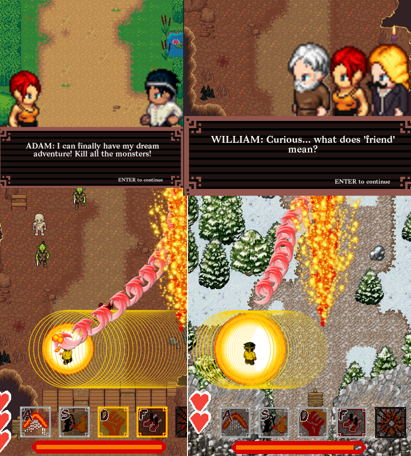

Welcome to ADAM, an open-source Shoot 'em up game!  
The game is published under the GNU GPLv3 license, so feel free to copy and modify the code as you wish, but keep it open! =D

How to install and play this, you ask?  

### WINDOWS

For Windows we have created a .exe file that can be downloaded from gitlab. 
1. Visit [https://gitlab.com/DavidLeonardWenzel/adam/-/tree/master/bin/WINDOWS](https://gitlab.com/DavidLeonardWenzel/adam/-/tree/master/bin/WINDOWS). You should see some .dll files, as well as adam.exe.
2. On the site in the upper right corner there is a download symbol. Click on it.
3. Download the source folder as a .zip file.
4. Unpack the .zip file. Go into the extracted folder named 'adam'.
5. Start adam.exe to play!

### LINUX

Under Linux, you can start the game directly using the source code!  
##### 1. Install Lua & LÖVE:    
(if you aleady have Lua and LÖVE installed skip this step)     
  
**ARCH:**  
`sudo pacman -S lua`  
`sudo pacman -S love`  
  
**UBUNTU:**   
`sudo apt install lua5.3`    
The following command should allow you to get the latest stable version of LÖVE (which is usually newer than the default apt-package):  
`sudo add-apt-repository ppa:bartbes/love-stable`  
`sudo apt-get update`  
`sudo apt install love`

##### 2. Clone and run source!
`git clone https://gitlab.com/DavidLeonardWenzel/adam.git`  
`love adam`  

### MAC

Under Mac, it's almost the same as with Linux. Just put the following commands in your terminal:  

##### 1. Install love via Homebrew:
`brew cask install love`

##### 2. Clone and run source!
`git clone https://gitlab.com/DavidLeonardWenzel/adam.git`  
`love adam`  

Alternatively, if you don't have Homebrew or git, you can also download the app by following these steps:
1. Visit [https://gitlab.com/DavidLeonardWenzel/adam/-/tree/master/bin/OSX](https://gitlab.com/DavidLeonardWenzel/adam/-/tree/master/bin/OSX). You should see a .zip file named adam_osx.zip.
2. On the site in the upper right corner there is a download symbol. Click on it.
3. Download the source folder as a .zip file.
4. Unpack the .zip file.
5. Start adam.app to play!

If you get the error "adam.app is damaged and can't be opened. You should move it to the Trash." then DO NOT move it Trash. 
This error occurs since the MAC gatekeeper blocks apps that have not been signed by default. 
To circumvent this, the gatekeeper needs to be disabled. If adam.app is opened once while the gatekeeper is disabled, then adam.app is also openable when the gatekeeper is enabled. To achieve this, do the following steps:
1. Open a terminal. One possiblity to do this is by opening the search bar via the key combination`cmd + space`, then entering "Terminal". If this is done right, then you should see a white window with some symbols on the left side.
2. Type in: `sudo spctl --master-disable`, which will disable the gatekeeper, then press enter.
3. This command will ask for your password. Type it in and then press enter.
4. Open adam.app. Then close it again.
5. Type in: `sudo spctl --master-enable`, which will enable the gatekeeper, then press enter.
6. Now you can play adam anytime!

---
This game is build using the [LÖVE](https://love2d.org/) framework and is written in [Lua](https://www.lua.org/) 5.3.   
Game art was created using [pixilart](https://www.pixilart.com/) and [Tiled Map Editor](https://www.mapeditor.org/).  
Spritesheets were created using [opengameart](https://opengameart.org/).   
Game Music was created by [ozzed](http://ozzed.net) and [Scott Arrc](https://scottarc.bandcamp.com).  
Please check the credits and Attribution.txt for more details!
